# Theparker: A shared parking app for extra income!

### Theparker is first open source - Android shared parking app!

Theparker is the app build for Android using Java and an iOS version is Already open source.

It uses Firebase Realtime Database and Firebase Storage.(Currently it uses static payment, nom payment gateway is added)  

There is an Admin App to create packages for Parking

---
## How To Start?
#### Set up your firebase account
#### Enable email and mobile login
#### Add google-services.json file for both theParker and theParker Admin app\
#### Add a admin email and password manually in firebase (to use admin app)
#### Note: You will need to add api key in manifest file for google map(google "how to enable google map api")
---

## FeatureS:

- [ ] Login using Google.
- [X] Login Using mobile Number.
- [x] Upload Your parking Spot
- [x] Search Parking Space.
- [x] Login Using Email.
- [ ] Check previous transactions.
- [ ] Add my Cars.
- [x] Book Parking.
- [ ] Upload parking screenshots.
- [x] Get direction to the parking spot.
- [x] Call the spot owner.
- [x] See previous parking Spot Added.
- [x] Check previous Booking.
- [ ] Local Notification.
- [X] Profile.

## Screenshots

<table style={border:"none"}>
<tr><td align="center"><figure>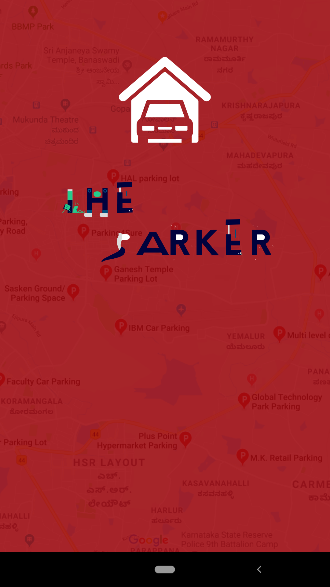<figcaption>Splash Screen</figcaption></figure></td>
<td align="center"><figure>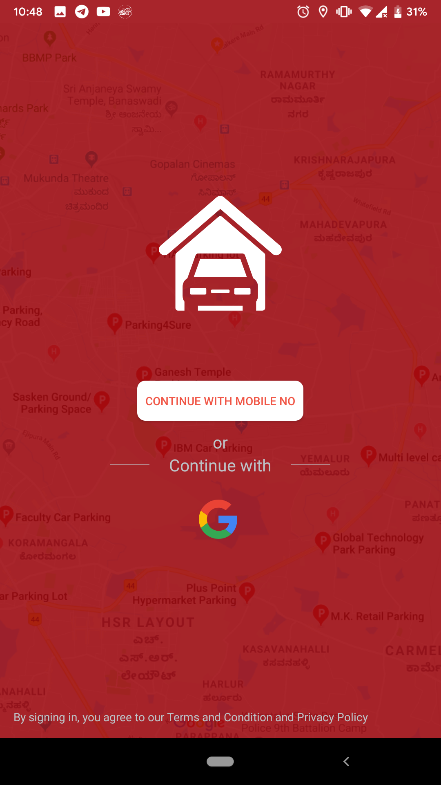<figcaption>Login Screen</figcaption></figure></td>
<td align="center"><figure>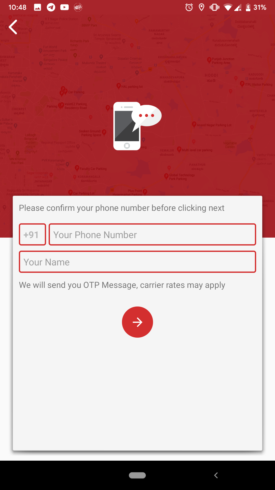<figcaption>Mobile No Login Screen</figcaption></figure></td></tr>
<tr><td align="center"><figure>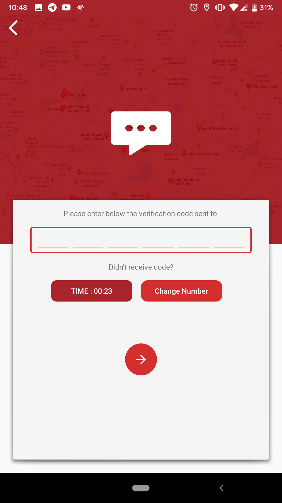<figcaption>OTP Fetch Screen</figcaption></figure></td>
<td align="center"><figure>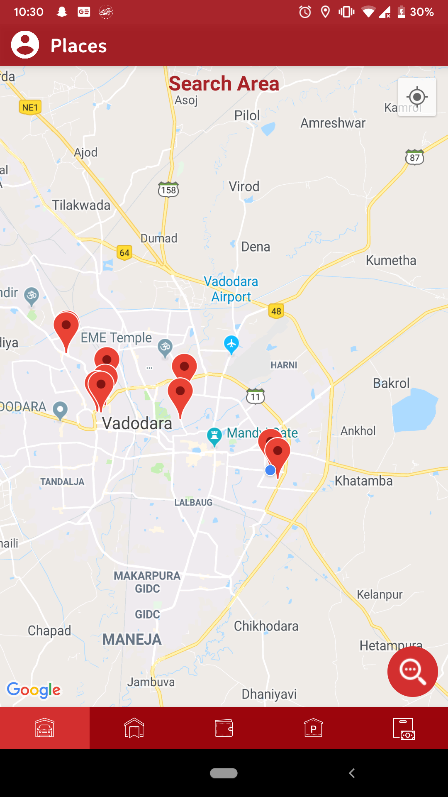<figcaption>Parking Pins on Map</figcaption></figure></td>
<td align="center"><figure>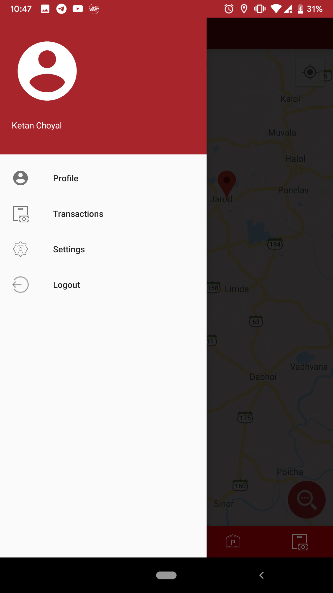<figcaption>Profile</figcaption></figure></td>
</tr>
<tr><td align="center"><figure>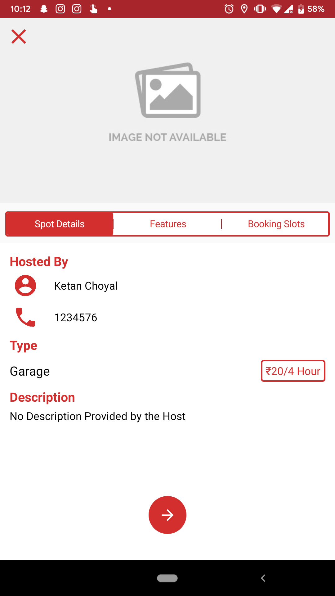<figcaption>Parking Details-1</figcaption></figure></td>
<td align="center"><figure>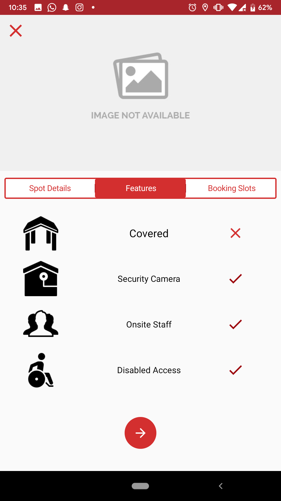<figcaption>Parking Details-2</figcaption></figure></td>
<td align="center"><figure>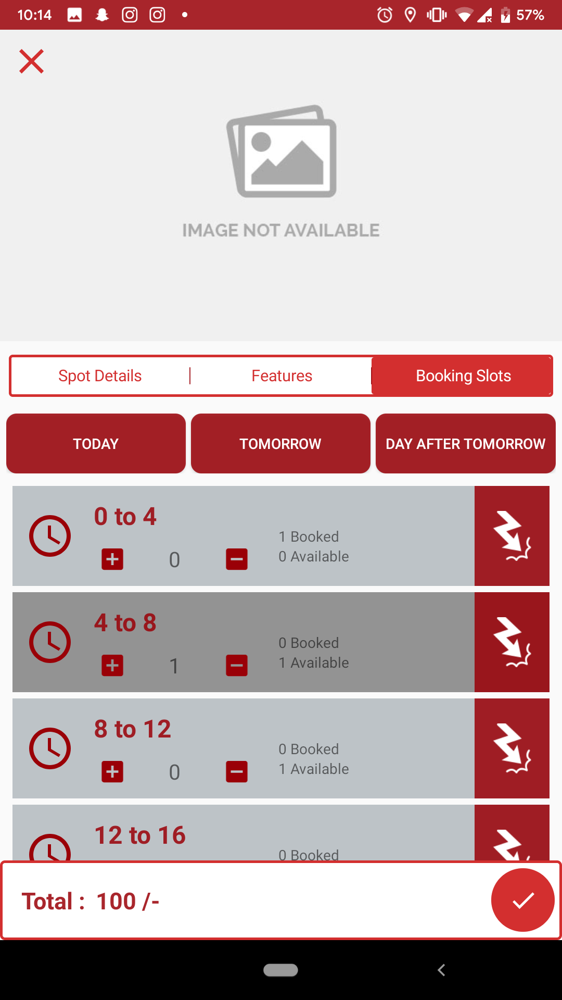<figcaption>Parking Details-3</figcaption></figure></td></tr>
<tr>
<td align="center"><figure><figcaption>Packages</figcaption></figure></td>
<td align="center"><figure>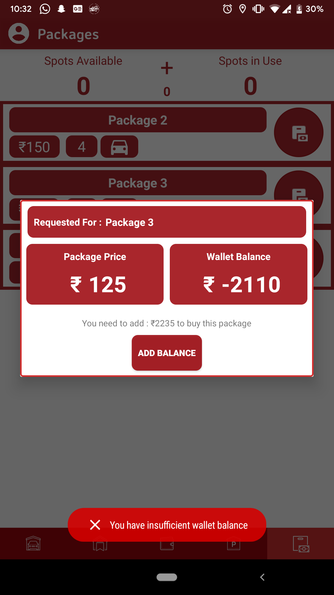<figcaption>Package Buy Dialog Box</figcaption></figure></td>
<td align="center"><figure>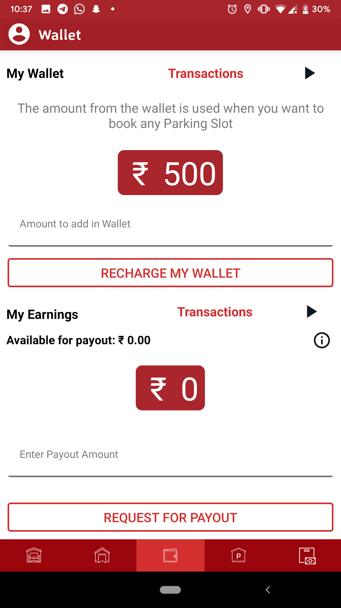<figcaption>Wallet</figcaption></figure></td>
</tr>
<tr>
<td align="center"><figure><figcaption>My Places</figcaption></figure></td>
<td align="center"><figure>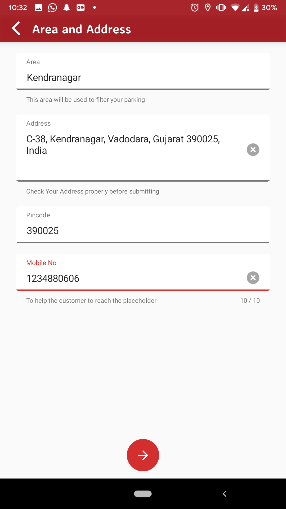<figcaption>Offer Place-1</figcaption></figure></td>
<td align="center"><figure>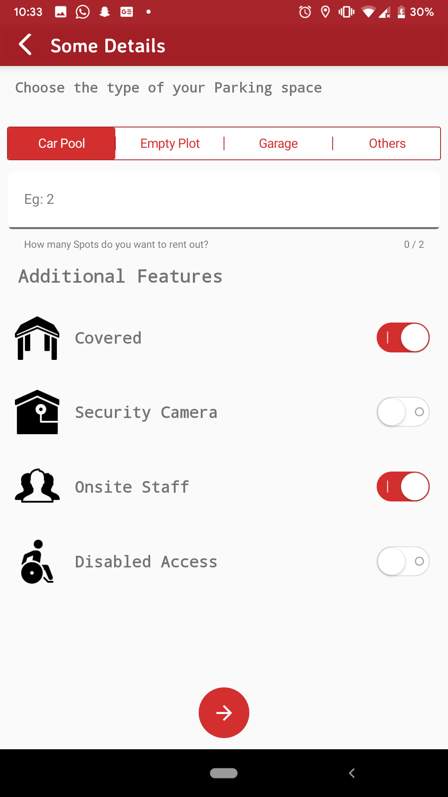<figcaption>Offer Place-2</figcaption></figure></td>
</tr>
</table>
